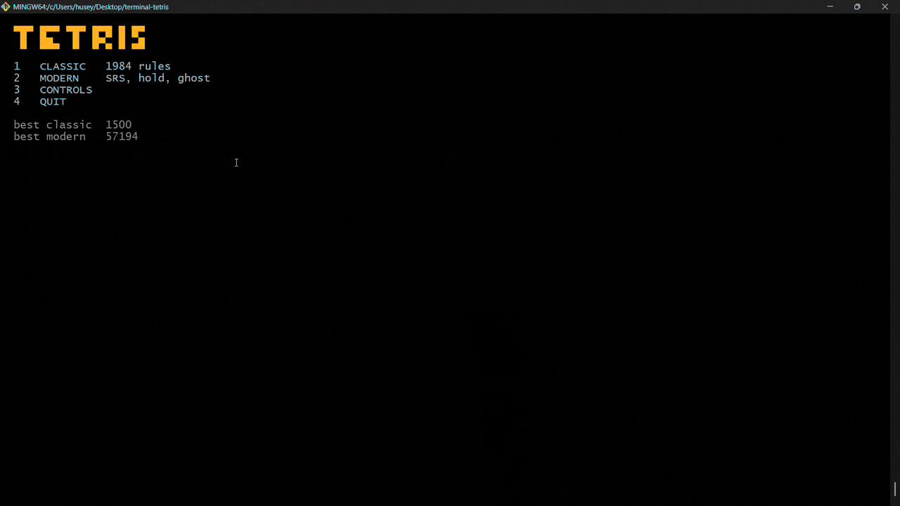

# terminal-tetris

Classic **and** modern Tetris, played in the terminal. Pure-Python game
core with **zero runtime dependencies** — the rules never touch the
screen, and the screen is nothing but ANSI escape codes.




## Two rule sets, one engine

Tetris has no single specification. The 1984 original and the 2001
Guideline standard disagree on a dozen things, and both are worth
playing — so both are implemented, selected from the menu, and separated
by a single configuration object rather than scattered `if` statements.

| | Classic | Modern |
|---|---|---|
| Rotation | simple — blocked means no rotation | SRS with wall kicks |
| Piece order | pure random | 7-bag |
| Hold | — | yes, once per piece |
| Ghost piece | — | yes |
| Next queue | 1 | 5 |
| Lock delay | — | 0.5 s, 15 resets |
| Scoring | 40 / 100 / 300 / 1200 x level | Guideline + T-spins, B2B, combos |

Every one of those differences is covered by parametrized tests that run
the same behaviour under both settings.

## Quick start

```bash
uv sync
uv run tetris
```

```bash
uv run tetris --mode classic   # skip the menu
uv run tetris --seed 42        # a reproducible piece sequence
```

Needs a terminal that understands ANSI escape codes — any modern Windows
Terminal, macOS Terminal or Linux console — and at least 32 rows of
height. The game says so plainly rather than drawing a broken screen.

## Controls

| Key | Action |
|---|---|
| left / right | move |
| up or X | rotate clockwise |
| Z | rotate counter-clockwise |
| down | soft drop |
| SPACE | hard drop |
| C | hold piece (modern only) |
| P | pause |
| ESC | back to the menu |
| Q | quit |

## Architecture

The one rule the whole project is built on: **`core/` knows nothing about
terminals.** No printing, no keyboard, no clocks — it takes actions and
time deltas in, and reports state.

```
src/tetris/
  core/          pure rules, fully testable headlessly
    board.py       the well: collision, locking, line clearing
    piece.py       seven tetrominoes, four rotation states each
    rotation.py    SRS wall-kick tables (and classic rotation)
    bag.py         piece generators: 7-bag and pure random
    scoring.py     score tables, level curve, T-spin detection
    rules.py       the config object that separates the two modes
    game.py        gravity, actions, the spawn-lock-clear cycle
    app.py         screen state machine: menu, play, pause, game over
    highscores.py  JSON persistence, defensive about broken files
  ui/            the terminal shell
    input.py       non-blocking keyboard (msvcrt / termios + select)
    renderer.py    ANSI escape codes, single-write frames
    screens.py     what each screen looks like
  __main__.py    the frame loop that connects the two halves
```

That split is what makes rules like wall kicks and T-spin detection
honest: they are tested by feeding board positions to a function, not by
squinting at a screen.

Three smaller decisions worth noting:

- **Immutable pieces.** Movement and rotation return new pieces rather
  than mutating one. Wall kicks try five candidate offsets and keep the
  first that fits — with immutable pieces, a rejected attempt costs
  nothing and needs no undo logic.
- **Pausing the game the game knows nothing about.** There is no
  `paused` flag inside the rules. The app simply stops calling `tick`,
  and time stops passing. The feature was added without touching the
  core at all.
- **Seeded randomness.** A given `--seed` replays the exact same
  sequence of pieces, so a bug report becomes "run seed 42" instead of
  "it happened once, I think".

## Testing

287 tests, ~98% coverage of the core, running on every push.

```bash
uv run pytest --cov=tetris
uv run ruff check . && uv run ruff format .
```

The approach, roughly in order of how much it has earned its keep:

- **Property tests over data.** The shape tables (7 pieces x 4 rotations)
  and the SRS kick tables (160 numbers) are transcribed by hand, so they
  are tested structurally: every piece has exactly four connected cells,
  every kick entry offers five candidates, and opposite rotations mirror
  each other. A sign error in a table is invisible to the eye and obvious
  to those tests.
- **Scenario tests that prove the mechanism.** It is easy to write a wall
  kick test that passes without any kick happening. These tests assert on
  the *kick index* — that the rotation succeeded because it was nudged,
  not because it already fitted.
- **Rule-matrix tests.** Each behavioural difference between the two
  modes is parametrized over both settings, so neither can drift silently.
- **Failure-mode tests.** The high score file is read defensively —
  missing, corrupt, or written by another version all mean "no scores
  yet" rather than a crash on startup.

## Development notes

The interesting problems in this project were rarely the Tetris rules.
They were the terminal: a newline in cbreak mode moves down without
returning to column one; a frame one row too tall makes the screen
scroll, after which "cursor home" no longer points home; and a short
screen drawn over a tall one leaves the bottom half of the old one
behind. `renderer.draw` documents all three, because each was found the
same way — by looking at a broken screen.

## Roadmap

Built in seven phases, each with acceptance criteria and a tagged
release — see [ROADMAP.md](ROADMAP.md). Ideas beyond v1.0: replay
recording (the seeded RNG already makes runs reproducible), a simple AI
player scoring board states, and a Rust port sharing the same rule tests.

## License

MIT